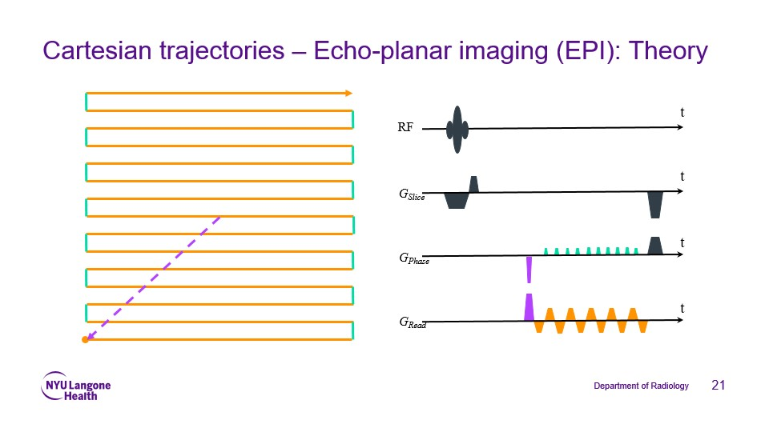

# ISMRM-2025-Surfing-School-Hands-On-Open-Source-MR
Materials for the ISMRM 2025 educational course "Surfing School Hands On Open Source MR" held on May 11, 2025

## Course links (you need to be registered for the ISMRM 2025 conference to access these ressources)
Sunday, May 11: [educational session](https://submissions.mirasmart.com/ISMRM2025/Itinerary/PresentationDetail.aspx?evdid=202)

Thursday, May 15: [mtrk oral session](https://submissions.mirasmart.com/ISMRM2025/Itinerary/PresentationDetail.aspx?evdid=1260) 

  

  

## Installing mtrk
Follow instructions for Vagrant install on [main page](https://github.com/mtrk-dev).
To ensure smooth installation and execution, it is better to have VirtulBox opened in the background. 

If mtrk is already installed, make sure it is up to date:
* Run `vagrant ssh`
* Go to the main folder `cd /opt/mtrk_designer_gui/` 
* Make sure you have the latest version of the code by running `sudo git pull`
* Same in the api folder `cd /opt/mtrk_designer_gui/app/mtrk_designer_api`
* Finally `sudo git pull` in the viewer folder `cd /opt/mtrk_viewer`

## Installing KomaMRI
Follow instructions on [their repository](https://github.com/JuliaHealth/KomaMRI.jl).
Check further documentation [here](https://juliahealth.org/KomaMRI.jl/stable/).

## Generating sequences with different readouts using mtrk
Four different readout strategies are offered in mtrk:
* Cartesian: a multi-shot Cartesian trajectory
* EPI: a single-shot Cartesian echo-planar trajectory
* Radial: a multi-shot radial trajectory (using golden angle)
* Spiral: a single-shot Archimedaen spiral trajectory.
  
These can be found in the block browser of the mtrk designer interface (check [main page](https://github.com/mtrk-dev) for an overview of the designer).

They can be used with any excitation pattern (either created from scratch or imported from a pre-existing sequence).
For this tutorial, 6 base sequences containing a spin-echo excitation, different timings (TE/TR), and resolutions (128/64) are provided in `Sequences/base_sequences`:
* `base_sequence_multiShot_TE60_TR4000_res64.mtrk`: spin echo exitation (1 slice), TE = 60ms, TR = 4000ms, resolution = 64, number of excitations = 64, adapted for multi-shot trajectories. 
* `base_sequence_multiShot_TE60_TR4000_res128.mtrk`: spin echo exitation (1 slice), TE = 60ms, TR = 4000ms, resolution = 128, number of excitations = 128, adapted for multi-shot trajectories. 
* `base_sequence_multiShot_TE200_TR4000_res128.mtrk`: spin echo exitation (1 slice), TE = 200ms, TR = 4000ms, resolution = 128, number of excitations = 128, adapted for multi-shot trajectories. 
* `base_sequence_singleShot_TE60_TR4000_res64.mtrk`: spin echo exitation (1 slice), TE = 60ms, TR = 4000ms, resolution = 128, number of excitations = 1, adapted for single-shot trajectories. 
* `base_sequence_singleShot_TE60_TR4000_res128.mtrk`: spin echo exitation (1 slice), TE = 60ms, TR = 4000ms, resolution = 128, number of excitations = 1, adapted for single-shot trajectories, TE is too short to support fully-sampled EPI readout. 
* `base_sequence_singleShot_TE200_TR4000_res128.mtrk`: spin echo exitation (1 slice), TE = 200ms, TR = 4000ms, resolution = 128, number of excitations = 1, adapted for single-shot trajectories. 

## Using different readouts in mtrk
The processus is identical for every readout. It is important to use a base sequence adapted for the chosen type of reaout (single- or multi-shot) to ensure the looping structure coherence. 

### A bit of theory

  

  

  

  

  

  

  

  

  
### Import base sequence
* Open the mtrk designer GUI,
* Choose a base sequence (different options available for short/longTE and resolution),
* Click on the upload button and load it. 

### Create a readout block
* Browse sequence blocks to examine `block_spinEcho`,
* Press shift and click on `block_delay` to move it apart from `block_refocusing`,
* Drag and drop a readout block between `block_refocusing` and `block_delay`,
* Generate mtrk & Pulseq files by clicking on the "Download" button.

### Check the results
* Load the mtrk file in the mtrk viewer to inspect it (see [main page](https://github.com/mtrk-dev) for details),
* Simulate the Pulseq file in KomaMRI (see simulation section of this tutorial for more). 

### Demo video

  

Check it [here](https://drive.google.com/file/d/12gL5K6YDvFFJc_neOKokY_u_S6xS06K_/view?usp=sharing). 

### More flexibility
It is possible to modify the sequence on-the-fly:
* Resolution and field of view (FOV) can be modified in the settings before inserting the readout in the sequence.
* If the resolution of a multi-shot sequence is modified, it is necessary to change the looping number as well in the loop settings to make it coherent with the new resolution.
* TE (in ms) is defined using the block durations of the excitation and refocusing blocks. You can modify them by adding or removing time to your convenience. The excitation block duration should be TE/2 - 1.3  and the refocusing block duration should be TE/2 + 2.68.  
* TR can be modified by setting the duration of the delay block to TR (in ms).
* All readout blocks assume that the refocusing block ends at TE and modifies its duration to be properly centered on the signal. If a readout block is deleted, the duration of the refocusing block should be reset to its original value before inserting another readout block.
* It is possible to use a multi-shot base sequence for single-shot readouts, by decreasing the number of loops from "Resolution" to 1. And vice-versa.

It is also possible to implement other readout strategies by adding or modifying functions in the API. Readout implementations are available in [ReadoutBlocks](https://github.com/mtrk-dev/mtrk_designer_api/tree/main/ReadoutBlocks):
* Calculations are done in [readoutWaveformGenerator.py](https://github.com/mtrk-dev/mtrk_designer_api/blob/main/ReadoutBlocks/readoutWaveformGenerator.py) in codes adapted from the [Pulpy]( https://github.com/jonbmartin/pulpy) library.
* SDL block implementation is done in [mtrkReadoutBlockGenerator.py](https://github.com/mtrk-dev/mtrk_designer_api/blob/main/ReadoutBlocks/mtrkReadoutBlockGenerator.py).
* Insertion of the block into the already existing sequence (the one showing in the GUI) is done in [readoutBlockGenerator.py](https://github.com/mtrk-dev/mtrk_designer_api/blob/main/ReadoutBlocks/readoutBlockGenerator.py).

If you are interested in contributing by implementing a new block, please let us know!

## Simulating obtained sequences in KomaMRI
The previously generated sequences can be tested using KomaMRI. The images shown in the presentation were obtained using two phantoms:
* A cylinder phantom with two different compartments, supporting long TEs,
* A brain phantom reproducing the caracteristics of a human brain and giving good results on shorter TEs. 

KomaMRI's graphical user interface can be used to simulate on the bain phantom, however it does not support the cylinder phantom. 

To simulate on either the cylinder or brain phantoms and obtain the same images featured in the presentation, go to  `Simulation` and run `educational2025_mtrk_simulation.jl`. This script will ask to provide the sequence folder, the sequence name and the phantom to simulate on before performing the simulation. 
It saves results as HTML files stored in `Simulation/Results`:
* `Simulation/Results/Sequences` stores a dynamic plot of the sequence,
* `Simulation/Results/Trajectories` stores a dynamic 3D plot of the k-space readout trajectory,
* `Simulation/Results/Images` stores a plot of the reconstructed image.

Expected results are stored in `Simulation/ExpectedResults`.

  

  

  

  

  

  

  

# A few references

## Books & website:​
* Bernstein, Matt A., Kevin F. King, and Xiaohong Joe Zhou. Handbook of MRI pulse sequences. Elsevier, 2004.​
* Brown, Robert W., et al. Magnetic resonance imaging: physical principles and sequence design. John Wiley & Sons, 2014.​
* https://mriquestions.com/index.html​

## Opens-source tools:​
* ODIN: Jochimsen Thies H, Von Mengershausen Michael. ODIN—object-oriented development interface for NMR.​
* SequenceTree: Magland, Jeremy F., et al. "Pulse sequence programming in a dynamic visual environment: SequenceTree." Magnetic resonance in medicine 75.1 (2016): 257-265.​
* Pulseq: Layton, Kelvin J., et al. "Pulseq: a rapid and hardware‐independent pulse sequence prototyping framework." Magnetic resonance in medicine 77.4 (2017): 1544-1552. Journal of Magnetic Resonance. 2004;170(1):67–78.​
* mtrk: Artiges A, Singh Saimbhi A, Lattanzi R, and Block KT, mtrk – A flexible open-source framework for developing MRI pulse sequences based on common web standards. ISMRM 2024, https://www.youtube.com/watch?v=KraT1FKSTcc​
* KSFoundation: Skare, Stefan, et al. An abstraction layer for simpler EPIC pulse programming on GE MR systems in a clinical environment. ISMRM 2017.​
* GinkgoSequence: Artiges, A., et al.: Ginkgo: a novel modular and Open Source MRI pulse sequence development framework dedicated to MRI systems, ISMRM 2022​
* JEMRIS: Stöcker, Tony, et al. "High‐performance computing MRI simulations." Magnetic resonance in medicine 64.1 (2010).​
* KomaMRI: Castillo‐Passi, Carlos, et al. "KomaMRI. Jl: an open‐source framework for general MRI simulations with GPU acceleration." Magnetic Resonance in Medicine 90.1 (2023): 329-342.​
* MRZero: Loktyushin, Alexander, et al. "MRzero‐automated discovery of MRI sequences using supervised learning." Magnetic Resonance in Medicine 86.2 (2021): 709-724.​
